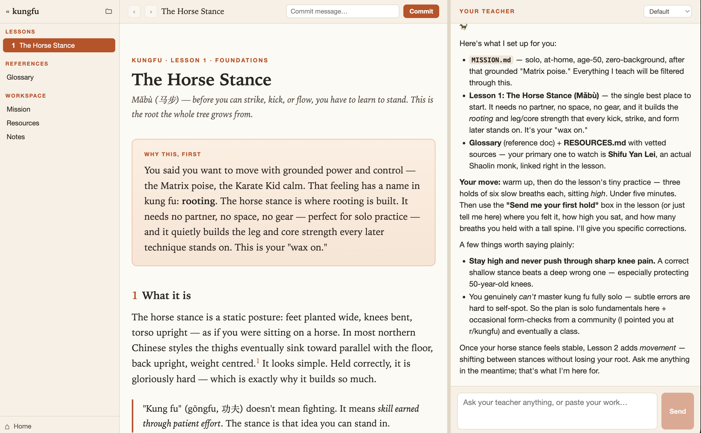

# Whetstone

**Sharpen what you know.** 

Whetstone is a desktop app that turns the
[`teach` skill](https://www.aihero.dev/learn-anything-with-my-teach-skill) into an
integrated, two-way learning environment. It wraps **Claude Code** running the
skill and adds a live bridge, so the AI-generated lessons aren't just things you
read — you can *do* them, and the teacher responds inside the lesson itself.



## What it is

A teaching session is a folder on disk (the "workspace") containing a `MISSION.md`,
lessons, reference docs, learning records, and notes. Whetstone gives that
workspace a home with three panes:

- **Left** — a sidebar of the workspace's **Lessons**, **References**, and the core
  **Workspace** docs (Mission / Resources / Notes).
- **Centre** — the **content view**: lessons and docs render here (beautiful,
  Tufte-inspired typography), with back/forward navigation and git **commit /
  push** controls.
- **Right** — your **teacher**: an agentic chat (powered by Claude Code) that
  plans the course, writes lessons, and answers questions.

The difference from opening lessons in a browser: lessons are **interactive both
ways**. When you submit an exercise, complete a quiz, or click "explain" inside a
lesson, it goes to the teacher; the teacher can render feedback inline, adapt the
lesson, record what you've learned, and schedule spaced-repetition reviews.

## Using it

You'll need [Claude Code](https://code.claude.com) installed and on your `PATH`
(`claude --version`), plus Node 20+.

```bash
npm install      # installs deps incl. the Electron runtime
npm run dev      # launches the app
```On launch you get a **Welcome** screen:

- **Open a folder…** — point Whetstone at any existing teaching-session folder.
- **New session** — type what you want to learn; Whetstone scaffolds a
  self-contained folder (starter docs + the teach skill + shared assets) and opens
  it.
- **Recent** — reopen a past session; it resumes where you left off.

Then just talk to your teacher in the right pane. Ask it to start a course, work
through the lessons it creates in the centre pane, and submit your exercises right
in the lesson. Use the header to **Commit** your progress (each session is its own
git repo) and **Push** it to a remote, the model dropdown to switch models, and the
📁 button to reveal the workspace folder in your file manager.

> Sessions are plain folders of Markdown/HTML — fully usable outside the app, and
> versioned with git.

## How it works (architecture)

```
RENDERER (Vue 3 + Pinia)            MAIN PROCESS
  sidebar | content iframe | chat     Workspace FS (the teaching workspace dir)
            ↑ IPC ↓                    Lesson server (HTTP serve + POST + WS)
                                       Bridge MCP server  ◀─ tool calls ─ claude
                                       claude subprocess (teach skill, stream-json)
```

- The app **spawns `claude`** (stream-json) and is **also an MCP server it connects
  to** — that closes the loop. Lesson interactions become synthesized user turns;
  the agent's `lesson_feedback` / `patch_lesson` / `schedule_review` /
  `record_learning` tool calls flow back to the lesson over WebSocket.
- Lessons render in a **cross-origin iframe** served by the local lesson server —
  on purpose: AI-generated HTML/JS is treated as untrusted and kept away from the
  app and its IPC bridge.
- The unit of state is the **workspace on disk** — no database. Per-app state
  (recent workspaces) lives in Electron `userData`; per-workspace UI state (session
  id, transcript) in a git-ignored `.teach-desktop.json`.

## Developer hints

```bash
npm run dev         # run the app (electron-vite)
npm test            # Vitest (unit + integration; no real claude, no real ports)
npm run test:watch  # watch mode
npm run typecheck   # vue-tsc, strict
npm run lint        # eslint
npm run build       # production bundle (electron-vite → out/)
npm run dist        # package a distributable (electron-builder → release/)
npm run dist:dir    # unpacked app only (faster; no installer/signing)
```

Layout:

```
src/
  shared/      pure domain — protocol, BridgeCore, stream-json parser, links (+ tests)
  main/        Electron main, lesson server, MCP server, claude harness, workspace lifecycle
  preload/     typed IPC surface (window.teach)
  renderer/    Vue app (Sidebar / content / chat, Pinia stores)
assets/        bridge.js + shared lesson assets (lesson.css, quiz.js) shipped to workspaces
.claude/skills/teach/   the teach skill (the brain), copied into new sessions
ExampleLesson/          a real sample workspace / test fixture
```

Conventions and gotchas:

- **TDD.** Domain logic is pure functions in `src/shared/` (and pure cores in
  `src/main`) so it tests without Electron, the network, or a live `claude` — those
  are injected. Tests never spawn a real `claude` or bind real ports for unit work.
- **Main-process changes require a full `npm run dev` restart** — the renderer
  hot-reloads, but `src/main` / `src/preload` (IPC, routes, the lesson server) do
  not pick up changes until you restart.
- **electron-vite config** uses `externalizeDepsPlugin()` for main/preload, so node
  deps (e.g. `ws`) load from `node_modules` at runtime rather than being bundled.
- **The teach skill** is invoked explicitly (it has `disable-model-invocation:
  true`): the app sends a `/teach` turn once on session start.
- **Untrusted lessons:** never give the lesson iframe node integration; it reaches
  the app only through the bridge's POST/WS protocol.

### Packaging

`npm run dist` produces a distributable in `release/` via **electron-builder**
(per-OS target: dmg / nsis / AppImage); `npm run dist:dir` produces just the
unpacked app for quick checks. The `teach` skill (`.claude/skills`) and shared
`assets/` are shipped as `extraResources`, and the app resolves them from
`process.resourcesPath` when packaged (and from the repo in dev) — so new-session
scaffolding works in a built app, no git or network required.

The app **icon** lives in `build/` (`icon.svg` is the source; `icon.icns` /
`icon.png` are generated and picked up automatically by electron-builder). To
regenerate after editing the SVG: `npx electron scripts/render-icon.cjs` rasterizes
it, then rebuild the `.icns` with `sips` + `iconutil`.

Not yet configured: **code signing / notarization** — set up signing identities
before distributing outside your own machine
(see <https://electron.build/code-signing>).

## Credit

Built on the **`teach`** skill by AI Hero —
<https://www.aihero.dev/learn-anything-with-my-teach-skill>.
